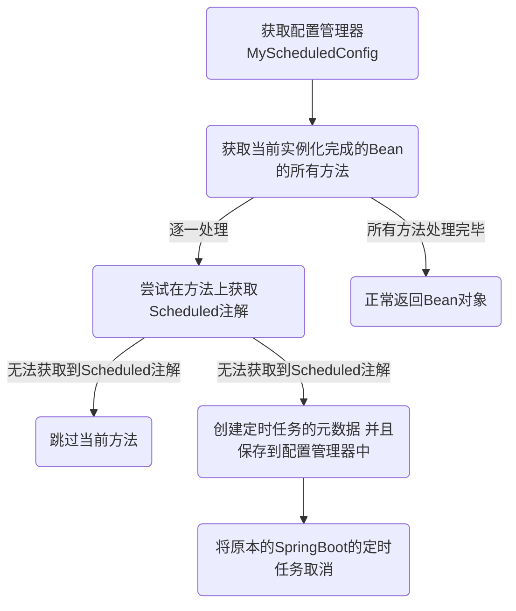
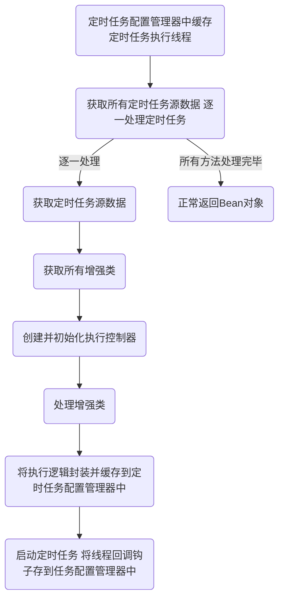

# 原理

## 自动注入定时任务

### 所用到的组件

- ApplicationContextAware 获取SpringBoot的上下文
- BeanPostProcessor 标记后置处理器，在每个Bean实例化之后进行后置处理
- @DependsOn 强制依赖 MyScheduledConfig

### Corn 表达式说明

## 注入自定义定时任务运行器

### 所用到的组件

- ApplicationContextAware 获取SpringBoot上下文
- ApplicationRunner 在Bean初始化之后执行自定义逻辑
- @DependsOn 强制依赖 threadPoolTaskScheduler