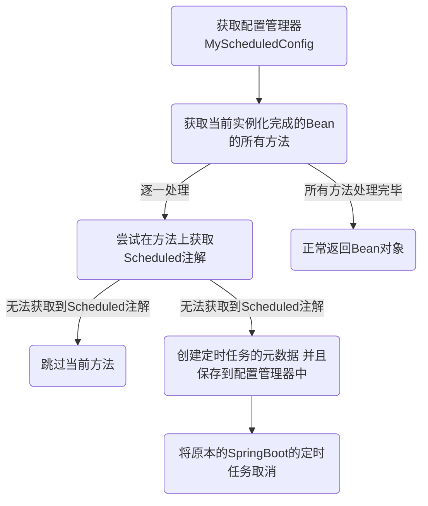

#原理

```mermaid
graph TB
 A(获取配置管理器MyScheduledConfig) --> B(获取当前实例化完成的Bean的所有方法)
 B -->|逐一处理| C(尝试在方法上获取Scheduled注解)
 B -->|所有方法处理完毕| D(正常返回Bean对象)
 C-->|无法获取到Scheduled注解| E(跳过当前方法)
 C-->|无法获取到Scheduled注解| F(创建定时任务的元数据 并且保存到配置管理器中)
 F-->G(将原本的SpringBoot的定时任务取消)
```